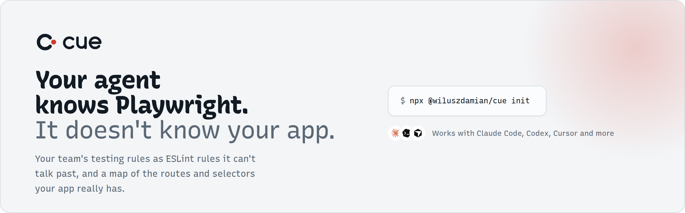
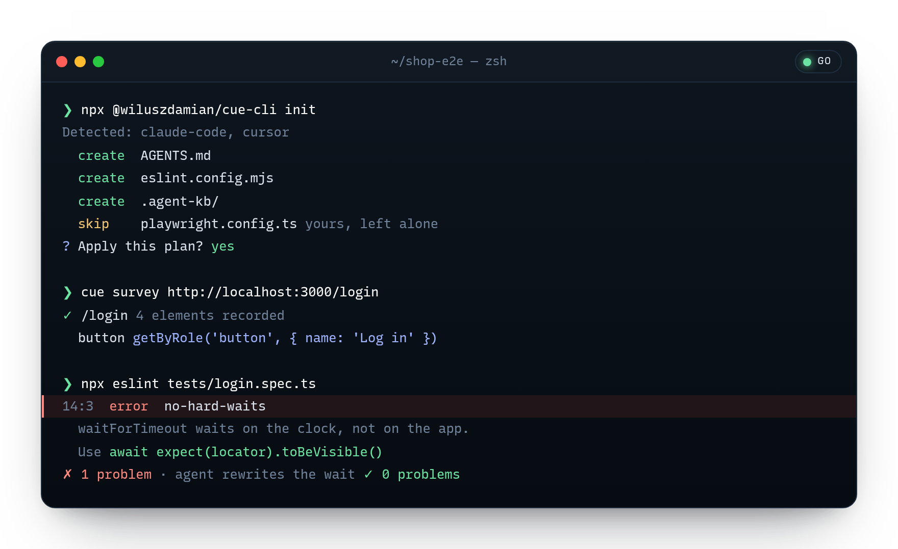
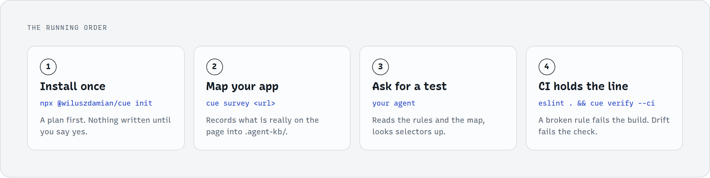

<picture>
  <source media="(prefers-color-scheme: dark)" srcset="assets/readme/banner-dark.png">
  
</picture>

<p align="center">
  <a href="https://www.npmjs.com/package/@wiluszdamian/cue"></a>
  <a href="LICENSE"></a>
  =24">
</p>

Ask an AI agent for a Playwright test and you get a reasonable test for some
other project. It invents selectors your app doesn't have and skips the
conventions your team agreed on. **Cue gives it its cues:**

- **Rules it can't talk past.** Your conventions ship as real ESLint rules, so a
  broken one fails the build. Every message says what is wrong and what to write
  instead.
- **A map of your actual app.** Cue records the routes and selectors that really
  exist into `.agent-kb/`, with a date and a confidence on every entry.

## Quick start

```bash
npx @wiluszdamian/cue init
```

It detects your agents, shows a plan, and writes nothing until you say yes. Or
hand your agent this line:

> Set up Cue in this Playwright project: run `npx @wiluszdamian/cue init`,
> show me the plan before writing anything, then run
> `npx @wiluszdamian/cue doctor` and fix what it reports.

<p align="center">
  
</p>

## How it works

<picture>
  <source media="(prefers-color-scheme: dark)" srcset="assets/readme/how-it-works-dark.png">
  
</picture>

Works with Claude Code, Codex, Cursor, Gemini CLI, Grok and OpenCode. The ESLint
rules also work with no agent at all, in CI and in your editor.

## Documentation

|                                                 |                                                  |
| ----------------------------------------------- | ------------------------------------------------ |
| [Getting started](docs/start/install.md)        | Install, set up your agent, teach it your app    |
| [All the rules](docs/reference/constitution.md) | Every rule, why it exists, what to write instead |
| [Who decides what](docs/reference/ownership.md) | Which source wins when advice conflicts          |
| [Commands](docs/help/commands.md)               | Every command and option                         |

The landing page and its docs live in [`site/`](site/README.md) (Astro).

**Not measured yet:** nobody has benchmarked whether agents write better tests
with Cue. The harness exists; the numbers don't. Until they do, we don't claim
it.

## Contributing

```bash
pnpm install
pnpm verify
```

Change behaviour in `rules/constitution.yaml`, then run `pnpm generate`. See
[CONTRIBUTING.md](CONTRIBUTING.md).

---

MIT licensed · Authored by [Damian Wilusz](https://github.com/wiluszdamian)
