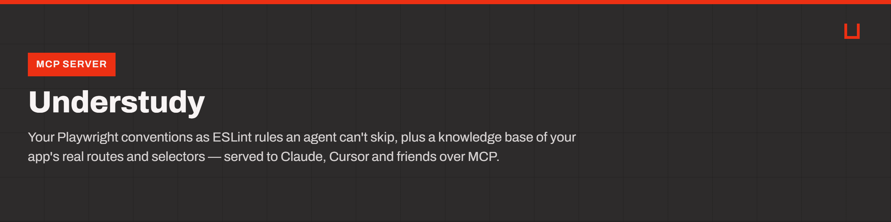

<p align="center">
  
</p>

<p align="center">
  <a href="CHANGELOG.md"></a>
  <a href="LICENSE"></a>
  =24">
</p>

# 🎭 Understudy

**Playwright tests your AI agent writes the way your team would.**

Ask an AI agent for a Playwright test and you get a reasonable test — for some
other project. It invents selectors your app does not have and skips the
conventions your team agreed on, because it has never seen your repo or your
application.

Understudy fixes that with two things:

- ⚖️ **Rules your agent cannot ignore**, because they are real ESLint rules. A
  document an agent skims is a suggestion; a failing build is not.
- 🗺️ **A map of your actual application**, so the agent uses selectors that exist
  instead of guessing.

---

## 🚀 Quick start

Node.js 22.13+ and a Playwright project (Understudy can scaffold one for you).

```bash
npx @understudy/cli init
```

It detects your agents, shows a plan, and writes nothing until you say yes.

```bash
npx @understudy/cli doctor
```

Every problem it reports comes with the command that fixes it.

```bash
npx @understudy/cli survey http://localhost:3000/login
```

It records what is really on the page into `.agent-kb/`. Now your agent knows the
button is called "Log in" and not `#btn-submit-2`.

Then just ask your agent for a test. It reads the rules and the map on its own.

---

## 📚 Documentation

Everything is plain Markdown in [`docs/`](docs/index.md) — nothing to build.

|                                                    |                                                        |
| -------------------------------------------------- | ------------------------------------------------------ |
| 🏁 [Getting started](docs/start/install.md)        | Install, set up your assistant, teach it your app      |
| 📖 [Guides](docs/guides/how-it-works.md)           | How it fits together, writing tests, working as a team |
| ⚖️ [All the rules](docs/reference/constitution.md) | Every rule, why it exists, what to write instead       |
| 🧭 [Who decides what](docs/reference/ownership.md) | Which source wins when advice conflicts                |
| 🛟 [Help](docs/help/troubleshooting.md)            | Commands, troubleshooting, FAQ                         |

The reference pages are generated from `rules/`; the rest is written by hand.

---

## 📦 What you get

After `init`:

| File                | What it does                                                 |
| ------------------- | ------------------------------------------------------------ |
| `AGENTS.md`         | The conventions, in the file every AI agent reads on its own |
| `eslint.config.mjs` | The same conventions as ESLint rules, so CI enforces them    |
| `.agent-kb/`        | What your application actually looks like                    |
| `tests/`, `pages/`  | A starter Playwright suite in the house style                |

Three promises about your files:

- ♻️ **Running `init` twice changes nothing.**
- 🔒 **A file you edited is never overwritten.** It is reported and left alone.
- ↩️ **Uninstalling reverses exactly what was installed**, from a record — not
  from guesswork.

---

## ⚖️ The rules

Eleven rules, ten enforced automatically:

`no-hard-waits` · `web-first-assertions` · `no-raw-selectors` ·
`no-locators-in-tests` · `strict-zod-objects` · `no-focused-tests` ·
`skips-need-a-reason` · `require-test-tags` · `no-explicit-any` ·
`no-hardcoded-urls` · `selectors-from-agent-kb` _(review only)_

They live in one file, `rules/constitution.yaml`. Change it, run `pnpm generate`,
and the ESLint rules, the docs and the agent instructions all update together.

Every rule explains itself — what is wrong, why, and what to write instead:

```bash
npx @understudy/cli explain no-hard-waits
```

---

## 🧩 Two ways to install

🪶 **Just the conventions** — no build step, nothing to configure:

```bash
npx skills add wiluszdamian/understudy
```

Also available as a plugin for Claude Code, Cursor, Codex, Grok, Gemini CLI and
OpenCode — see [Install for your assistant](docs/start/plugins.md).

🔧 **The full product** — the conventions plus the enforcement:

```bash
npx @understudy/cli init
```

The difference is what happens when an agent ignores the advice. With the catalog
alone, nothing. With the ESLint preset, the build fails.

> 📌 Published as **`@understudy/cli`**. The bare name `understudy` on npm belongs
> to an unrelated project, so always install the scoped name. Once installed, the
> local command is just `understudy`.

---

## 🤔 Why not just write it in a document?

Because an agent can talk itself past a document, and a teammate who never reads
it is not breaking any build. The ESLint rules work with no agent involved at
all: in CI, in an editor, and in two years.

Understudy also does not try to teach Playwright. Microsoft's official skills
cover running and debugging tests, and a community skill covers general best
practice. Understudy installs those and defers to them. What it adds is the part
nobody else can know: your repo's rules, and your app's shape. When those sources
disagree, [one table](docs/reference/ownership.md) says which wins.

---

## 📊 Status

Working today: the rules engine, the ESLint plugin, the CLI, the knowledge base,
the MCP server and the skill catalog. Current release: **v0.8.0** — see
[CHANGELOG.md](CHANGELOG.md).

⚠️ **Not proven yet:** nobody has measured whether agents actually write better
tests with Understudy. The tool to measure it exists; the measurement does not.
Until it does, this project does not make that claim — see
[Does it actually work?](docs/guides/does-it-work.md).

---

## 🛠️ Contributing

Requires Node `^22.13 || >=24` and pnpm 10+.

```bash
pnpm install
pnpm verify
```

`verify` runs format, lint, typecheck, tests and the drift check. Change
behaviour by editing `rules/constitution.yaml`, then run `pnpm generate` — the
plugin, the docs and the MCP tools are all downstream of that one file.

📄 [MIT](LICENSE)
